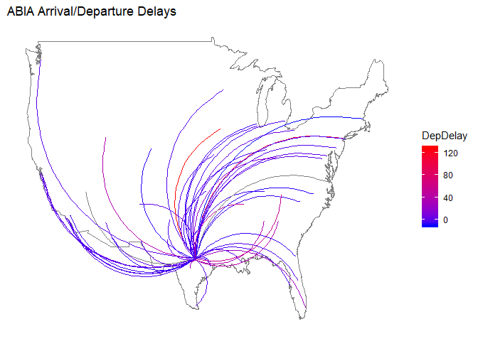
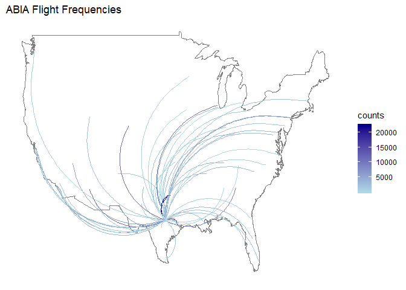
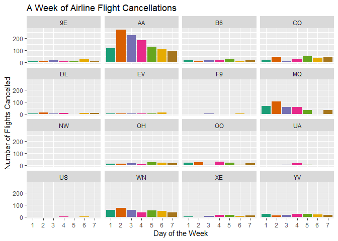
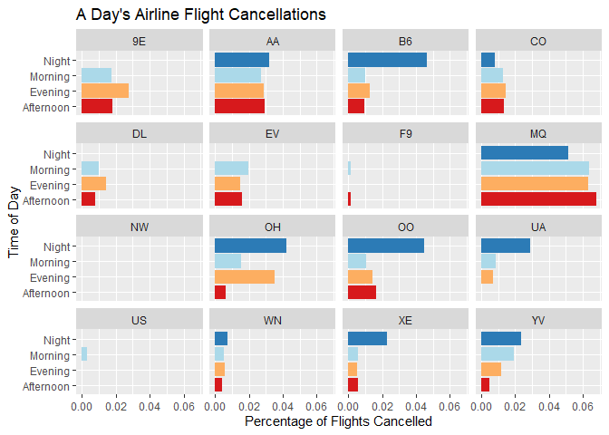
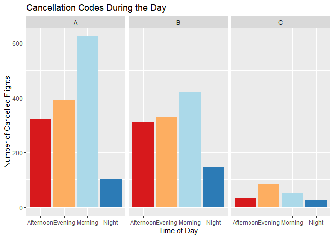

Visualisation
================
Pooja Shah
12/08/2019

## Maps

For anyone unfortunate enough to be taking a flight, one of the biggest
concerns on their mind might be, “Will my plane be delayed?” Such a
possibility is frustratingly common and worse, unpredictable

On the *slightly* brighter side, we can at least tell which flights have
historically been delayed more often than most, be it due to weather,
traffic, or any other obstruction.

<!-- -->

Here is a map of flights to and from Austin-Bergstrom International
Airport. Several high-risk flights stand out in red.

<!-- -->

Compare that to how common flights to each destination are, and you can
see that the most-delayed flights are not the most common to occur.

## Cancellations

Worse than a flight being delayed is a complete cancellation. See the
plots below for the times were flights have historically been cancelled
most often, grouped by each airline.

    ## 
    ##   9E   AA   B6   CO   DL   EV   F9   MQ   NW   OH   OO   UA   US   WN   XE 
    ##  102 1136  124  236   40   28    4  340    0  116  124   34    4  366   58 
    ##   YV 
    ##  128

<!-- -->

Now let’s examine them by time of day:

<!-- -->

Northwest Airlines had no cancellations\!

Below are the types of cancellations that happen during the day.

<!-- -->
