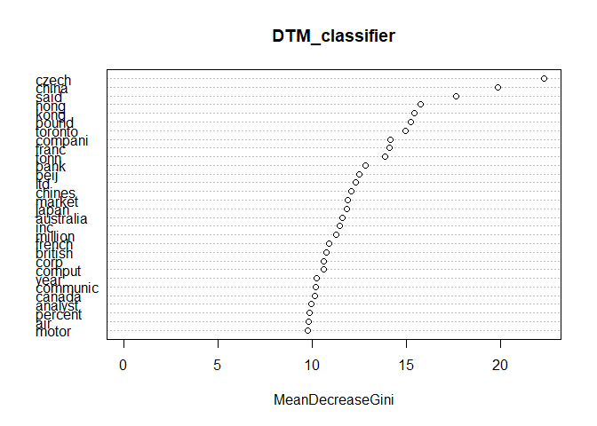
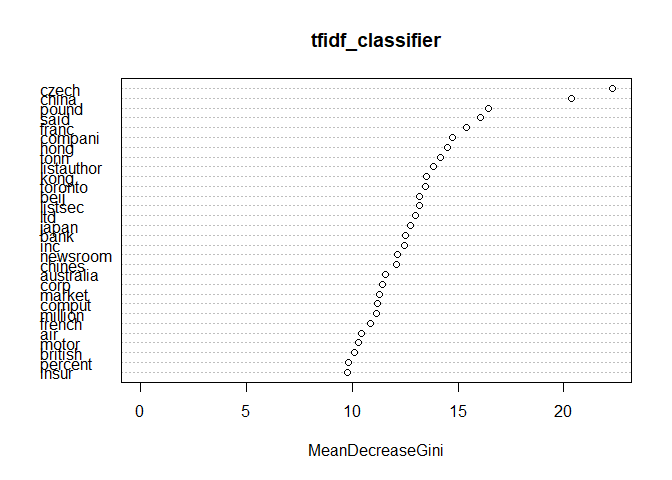
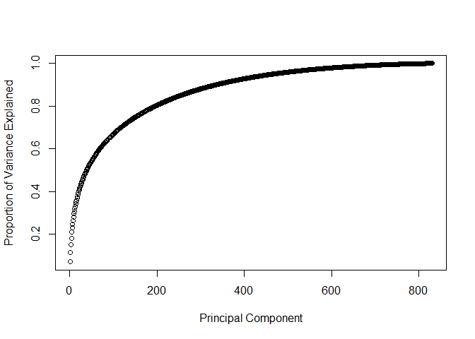
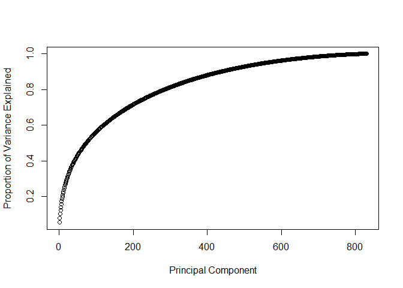

Author Attribution
================

### The problem is to predict the author of a given article. We have 2500 training articles of 50 different authors and the same number of test articles.

### Data Preprocessing

The first step is to read all the files.

    ## [1] "C50test/AaronPressman/421829newsML.txt"
    ## [2] "C50test/AaronPressman/424074newsML.txt"
    ## [3] "C50test/AaronPressman/42764newsML.txt" 
    ## [4] "C50test/AaronPressman/43033newsML.txt" 
    ## [5] "C50test/AaronPressman/433558newsML.txt"
    ## [6] "C50test/AaronPressman/436774newsML.txt"

The file names are messy so we can format them by taking the author name
and joining it with the names of each
    file.

    ## [1] "AaronPressman421829newsML.txt" "AaronPressman424074newsML.txt"
    ## [3] "AaronPressman42764newsML.txt"  "AaronPressman43033newsML.txt" 
    ## [5] "AaronPressman433558newsML.txt" "AaronPressman436774newsML.txt"

The author names are extracted by using the file paths and extracting
just the second word from the path, which is the author
    name

    ## [1] "AaronPressman" "AaronPressman" "AaronPressman" "AaronPressman"
    ## [5] "AaronPressman" "AaronPressman"

Now we need to perform different transformations on the data. 1. Convert
the all the alphabets to lowercase 2. Remove numbers and punctuations 3.
Strip whitespaces - spaces, tabs, etc 4. Stem words. This means that
words like sing, singing, sings, etc all become sing 5. Remove stop
words, that is words like the, a, to, etc, that occur frequently in
English.

Now we create the document term matrix(DTM), which is a matrix
containing the counts of word in each documents.

    ## <<DocumentTermMatrix (documents: 5000, terms: 32021)>>
    ## Non-/sparse entries: 1006748/159098252
    ## Sparsity           : 99%
    ## Maximal term length: 45
    ## Weighting          : term frequency (tf)

We can see that 99% of the natrix is sparse(0 values) and we have 32021
words

Now, we will remove values that are the most uncommon as they add noise
to the data. We remove the terms that have count 0 in \>95% of documents

    ## <<DocumentTermMatrix (documents: 5000, terms: 830)>>
    ## Non-/sparse entries: 645959/3504041
    ## Sparsity           : 84%
    ## Maximal term length: 13
    ## Weighting          : term frequency (tf)

We have 830 words and the matrix is 84% sparse.

Now we convert the DTM to a data frame and add the author labels to the
data frame

After this, we split the data into train and test sets. The first 2500
observations go into the training set and the rest go in the test set.

Now we create the Term Frequency–Inverse Document Frequency (tf-idf)
matrix. We add the author names and split it, similar to the way we did
for the DTM.

### Predictive Modelling

First we will run a random forest model on the DTM data.

    ## [1] 0.6212

The accuracy on the test data is 62.12%.

The plot below gives the list of important variables
<!-- -->

Using the variable importance values, we take the 250 most important and
rerun the model with just those variables

    ## [1] 0.5888

The accuracy is now 58.88% which is close to the accuracy with the model
with all the variables.

On running the Random Forest model on the tfidf data and we get 61.16%
accuracy.

    ## [1] 0.6116

Similar to the DTM, we find the important variables and re-run the
model.
<!-- -->

    ## [1] 0.6012

The accuracy is 60.12% which is almost the same as the accuracy with all
variables on the tfidf data.

### Principal Component Analysis

First we run the PCA on the DTM data
<!-- -->

On plotting the proportion of variance explained for each Principal
Components, we can see that around 400 Principal Components explain 80%
of the variance in the data.

We run the Random Forest Model again on this data. A point to be noted
here is that we cannot run PCA on the train and test data together. Nor
can we run PCA on train data and then use it to predict the test data
values.

So we take the transformations of the training data and use them to
change the test data. This can be done simply by using the predict
function

Now we test our model on this new transformed data.

    ## [1] 0.4764

We get an accuracy of 47.64% Which is not as good as the accuracy of the
model run on the actual variables instead of the Principal Components.

Now we will perform the same steps for the tfidf data.

<!-- -->

Here, around 350 Principle Components explain 80% of the variance so run
the model with that many PCs and get an accuracy of 52.84% which is much
better than the accuracy on the DTM-PC model.

    ## [1] 0.5284

We also tried a naive bayes model on the tfidf principle components data
and got an accuracy of 47.08%.

    ## [1] 0.4708

Based on the models we have run, the Random Forest Model on the DTM data
with the 250 variables is the best one. Even though the model with all
variables gives a slightly better accuracy, the selected model makes up
for it by being less complex.
