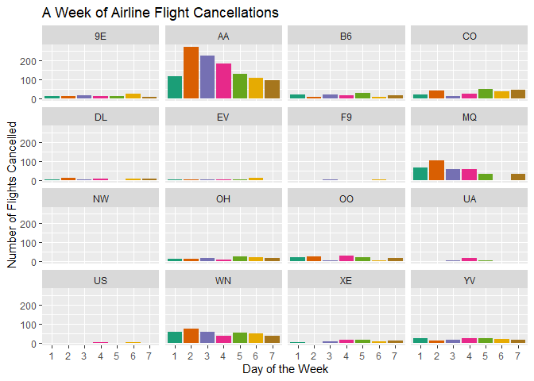
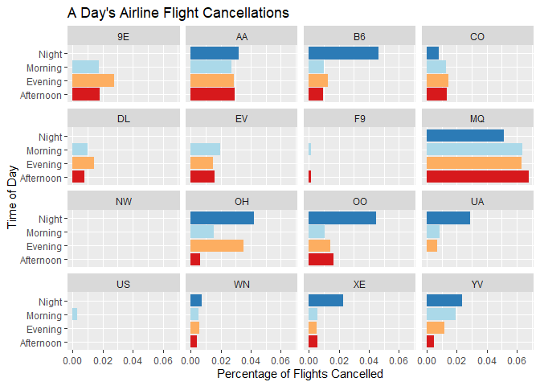
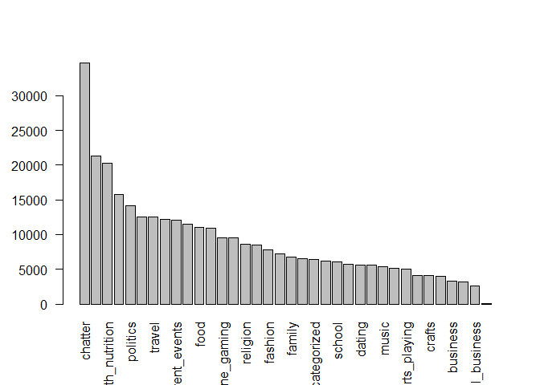
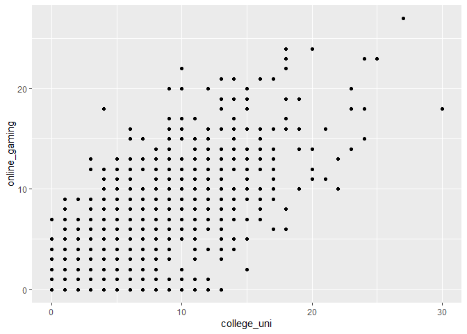
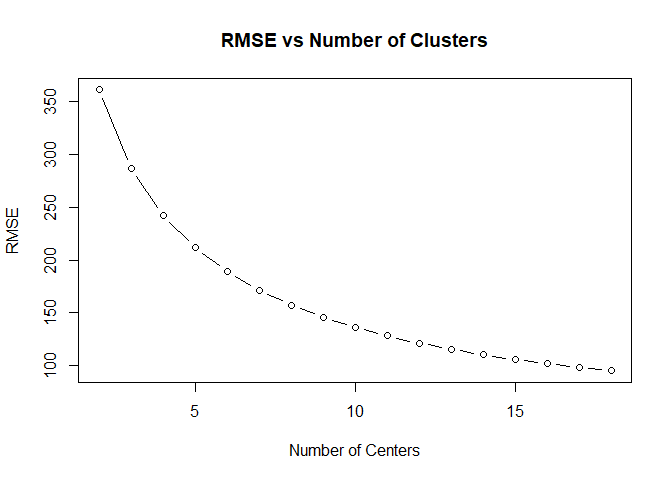

# STA380_exercises
This repository contains responses to the case study exercises for the STA 380 Predictive Models course in the UT McCombs MS Business Analytics program. The case studies can be found [here](https://github.com/jgscott/STA380/blob/master/exercises/README.md).

## Contributors
- Saurabh Bodas
- David Owen
- Pooja Shah
- Hannah Warren

# Visual story telling part 1: green buildings

(Code goes here)

# Visual story telling part 2: flights at ABIA

## Maps

For anyone unfortunate enough to be taking a flight, one of the biggest
concerns on their mind might be, "Will my plane be delayed?" Such a
possibility is frustratingly common and worse, unpredictable

On the *slightly* brighter side, we can at least tell which flights have
historically been delayed more often than most, be it due to weather,
traffic, or any other obstruction.

<!-- -->

Here is a map of flights to and from Austin-Bergstrom International
Airport. Several high-risk flights stand out in red.

<!-- -->

Compare that to how common flights to each destination are, and you can
see that the most-delayed flights are not the most common to occur.

## Cancellations

Worse than a flight being delayed is a complete cancellation. See the
plots below for the times were flights have historically been cancelled
most often, grouped by each airline.

<!-- -->

Now let's examine them by time of day:

<!-- -->

Northwest Airlines had no cancellations\!

Below are the types of cancellations that happen during the day.

<!-- -->

# Portfolio Modeling

Please see finalproj.rmd file for graphs/vizualizations. 
I selected the portfolios with the intention of giving each one a different aim, despite all of the ETF's being chosen from either the China ETF category, the Japan ETF category, Euro ETF category, or the Emerging Markets category. The first portfolio was chosen by being comprised of ETF's which have the highest previous day's closing cost. It contained 5 ETF's (EDEN, GXC, CXSE, QEMM, and IEMG), with closing costs ranging from $47.99 to $87.82. The second portfolio contained 4 ETF's (FSZ, JPMV, FCA, and TUR), and those ETF's were chosen with the aim of minimizing the percent change from the previous day (in order to minimize short-term volatility). The third portfolio contained 7 ETF's (EWJ, EWL, EWN, ASHR, KFYP, GREK, and ERUS), and were chosen with the intention of maximizing YTD, in order to maximize long-term growth. 
For the first portfolio the VaR was equal to 93091.06. That means that there is if there were no trading over the course of a day, there is a 5% chance that the stock would decrease in value by $93,091.06. 
For the 2nd portfolio, the VaR was equal to 93291.91, and the third portfolio had a VaR of 91864.87. These both translate to roughly the same thing as did portfolio 1. 
Looking at the histograms, portofolio 1 had a maximum value between 100000 and 102000, implying that at the very least, you would make back what you'd invested a majority of the time. Portfolio 2 had an absolute maximum value between 100000 and 101000, implying that you'd also make back your money by investing in that stock a majority of the time. Histogram 3 however had a majority of values between 98000 and 100000, implying that a majority of days, you would actually be losing money. 
This narrows us down to Portfolio 1 and Portfolio 3. Looking back at VaR, we see that portfolio 1 has a fatter tail than portfolio 3, therefore we choose Portfolio 3 for the purpose of our experiment.

# Market Segmentation

## Data Description

We have a dataset of the number of tweets from customers of an
anonymised firm, in terms of categories of the tweets.

A brief summary of the data:

<!-- -->

‘Chatter' category (uncategorised posts) has the most number of posts,
which isn't informative. Photo-sharing, nutrition, cooking, and politics
are also popular categories.

Are there any categories that are positively correlated with each other?

<!-- -->

Online gaming and universties are correlated categories. Let us plot a
correlation for all categories.

    ## Warning: package 'corrplot' was built under R version 3.6.1

    ## corrplot 0.84 loaded

<!-- -->

The following categories are highly correlated: (represented by dark
squares)

1)  Personal fitness & nutrition,
2)  fashion and cooking,
3)  politics and travel,
4)  religion and sports fandom
5)  Online gaming and universities

However, these show us correlations in two dimensions. To better
understand market segments, let us perform k-means clustering.

## K-means Clustering

Including only the measureable categories for clustering:

### Choosing the value of K

Choosing the number of clusters is completely subjective based either on
business goals or mathematical basis. Let us plot the elbow plot to get
a sense of the number of clusters to be used.

<!-- -->

Let us choose k = 5 as the optimum number of clusters.

K-means clustering will provide us with information on what posts are
tweeted togeher, which will help us create buyer personas in order to
better tailor advertising
    campaigns.

### CLuster 1

    ##       chatter      politics photo_sharing   college_uni        travel 
    ##      6.533920      4.398869      3.885678      3.432161      3.168970 
    ##          news 
    ##      2.568467

### Cluster 2

    ##          cooking    photo_sharing          fashion          chatter 
    ##        11.241007         6.008993         5.719424         4.517986 
    ##           beauty health_nutrition 
    ##         3.994604         2.372302

### Cluster 3

    ## health_nutrition personal_fitness          chatter          cooking 
    ##        12.093574         6.506201         4.166855         3.267193 
    ##         outdoors    photo_sharing 
    ##         2.768884         2.506201

### Cluster 4

    ## sports_fandom      religion          food     parenting       chatter 
    ##      6.000000      5.401077      4.641992      4.161507      4.083445 
    ##        school 
    ##      2.769852

### Cluster 5

    ##          chatter    photo_sharing   current_events health_nutrition 
    ##        3.6615497        1.8652534        1.3421053        1.0913743 
    ##           travel         politics 
    ##        1.0609162        0.9973197

## Market Segments

Our clustering analysis suggests the following market segments:

1)  **Young parents:** This segment has shared posts about parenting and
    schooling - suggesting that they might be parents of a young child,
    discovering the ways of parenting. Posts about religion and sports
    may suggest that they're trying to generate an interest in these
    categories regarding these categories.

2)  **Knowledgeable college students**: This segment has shown activity
    in categories such as college, current events, and travelling.
    College students travel often for vacation, studies, or internships,
    and thus, this segment appears to represent smart college students.

3)  **Health freaks**: Cooking, health & nutrition, and personal fitness
    would mean that this segment is committed to maintain great health.

4)  **Tech-savvy business travellers**: With posts spanning politics,
    technology, news, and travel, this segment possibly represents
    well-educated business-people who travel often for work.

5)  **Millenial Influencers**: This segment indulges in shopping,
    fashion, and photo-sharing. They're possibly social media
    influencers.

As we can see, all segments generally point towards a young customer
base. These segments can help our client design better marketing
rhetoric.

# Author Attribution

(Code goes here)

# Association Rule Mining

## The Data in Question

The data to be examined contains fifteen thousand grocery store
transactions. Each transaction contains between 1 and 4 items,
inclusive. The head of the dataset is previewed
below.

| V1               | V2                  | V3             | V4                       |
| :--------------- | :------------------ | :------------- | :----------------------- |
| citrus fruit     | semi-finished bread | margarine      | ready soups              |
| tropical fruit   | yogurt              | coffee         | NA                       |
| whole milk       | NA                  | NA             | NA                       |
| pip fruit        | yogurt              | cream cheese   | meat spreads             |
| other vegetables | whole milk          | condensed milk | long life bakery product |
| whole milk       | butter              | yogurt         | rice                     |

Before looking for association rules apriori, it is important to examine
the frequency with which each item is purchased in case there is a
heavily skewed support distribution. Such analysis gives an indication
of the importance of lift in the rules to be produced.

<!-- -->

A closer inspection of the far right spike finds that the following
items are very common in the dataset. Here they are:

| Item             | Occurrences |
| :--------------- | ----------: |
| yogurt           |        1372 |
| soda             |        1715 |
| rolls/buns       |        1809 |
| other vegetables |        1903 |
| whole milk       |        2513 |

None of the most common items are surprising to see in the table. Given
that information, a threshold for minimum lift will be considered
carefully, and rules produced which include the above items will be
heavily scrutinized.

## Generate Rules

First, let's examine every rule generated with at least 100 instances of
the associated purchase pattern (support) and a 10% chance of the right
hand item(s) being purchased with the left-hand item. Since some items
are much more frequent than the others, we will also set an initial lift
threshold of 1, so we know there's at least some significance to the
pattern.

Under these conditions, 500 rules are produced. The frequent single
items above are still overly present in the rules, even with the
restriction on lift.

<!-- -->

The threshold will be raised to prune the rules.

<!-- -->

Now there are about 30. As displayed above, the most significant rules
have been picked. These include many larger frequent itemsets with a few
small frequent itemsets.

## Analysis

Under the above conditions, an even balance of complex and simple rules
are produced. The common items still apear in many of the rules, but
with the restrictions on lift, we can confidently say that the rules
indicate a significant tendency for them to appear in those itemsets.
Some of the rules also exist in both directions with high confidence,
showing that the correlation is mutual.

Objectively, we can say that these rules are superior by the high
threshold for lift. Subjectively, many of them are sensible, like the
correlations between herbs, fruits, and vegetables or butter and milk.

