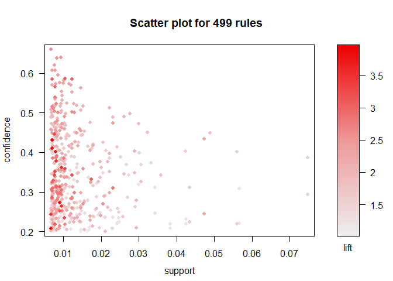

# STA380_exercises
This repository contains responses to the case study exercises for the STA 380 Predictive Models course in the UT McCombs MS Business Analytics program. The case studies can be found [here](https://github.com/jgscott/STA380/blob/master/exercises/README.md).

## Contributors
- Saurabh Bodas
- David Owen
- Pooja Shah
- Hannah Warren

# Visual story telling part 1: green buildings

(Code goes here)

# Visual story telling part 2: flights at ABIA

## Maps

For anyone unfortunate enough to be taking a flight, one of the biggest
concerns on their mind might be, "Will my plane be delayed?" Such a
possibility is frustratingly common and worse, unpredictable

On the *slightly* brighter side, we can at least tell which flights have
historically been delayed more often than most, be it due to weather,
traffic, or any other obstruction.

<!-- -->

Here is a map of flights to and from Austin-Bergstrom International
Airport. Several high-risk flights stand out in red.

<!-- -->

Compare that to how common flights to each destination are, and you can
see that the most-delayed flights are not the most common to occur.

## Cancellations

Worse than a flight being delayed is a complete cancellation. See the
plots below for the times were flights have historically been cancelled
most often, grouped by each airline.

<!-- -->

Now let's examine them by time of day:

<!-- -->

Northwest Airlines had no cancellations\!

Below are the types of cancellations that happen during the day.

<!-- -->

# Portfolio Modeling

(code goes here)

# Market Segmentation

(code goes here)

# Author Attribution

(Code goes here)

# Association Rule Mining

## The Data in Question

The data to be examined contains fifteen thousand grocery store
transactions. Each transaction contains between 1 and 4 items,
inclusive. The head of the dataset is previewed
below.

| V1               | V2                  | V3             | V4                       |
| :--------------- | :------------------ | :------------- | :----------------------- |
| citrus fruit     | semi-finished bread | margarine      | ready soups              |
| tropical fruit   | yogurt              | coffee         | NA                       |
| whole milk       | NA                  | NA             | NA                       |
| pip fruit        | yogurt              | cream cheese   | meat spreads             |
| other vegetables | whole milk          | condensed milk | long life bakery product |
| whole milk       | butter              | yogurt         | rice                     |

Before looking for association rules apriori, it is important to examine
the frequency with which each item is purchased in case there is a
heavily skewed support distribution. Such analysis gives an indication
of the importance of lift in the rules to be produced.

<!-- -->

A closer inspection of the far right spike finds that the following
items are very common in the dataset. Here they are:

| Item             | Occurrences |
| :--------------- | ----------: |
| yogurt           |        1372 |
| soda             |        1715 |
| rolls/buns       |        1809 |
| other vegetables |        1903 |
| whole milk       |        2513 |

None of the most common items are surprising to see in the table. Given
that information, a threshold for minimum lift will be considered
carefully, and rules produced which include the above items will be
heavily scrutinized.

## Generate Rules

First, let's examine every rule generated with at least 100 instances of
the associated purchase pattern (support) and a 10% chance of the right
hand item(s) being purchased with the left-hand item. Since some items
are much more frequent than the others, we will also set an initial lift
threshold of 1, so we know there's at least some significance to the
pattern.

Under these conditions, 500 rules are produced. The frequent single
items above are still overly present in the rules, even with the
restriction on lift.

<!-- -->

The threshold will be raised to prune the rules.

<!-- -->

Now there are about 30. As displayed above, the most significant rules
have been picked. These include many larger frequent itemsets with a few
small frequent itemsets.

## Analysis

Under the above conditions, an even balance of complex and simple rules
are produced. The common items still apear in many of the rules, but
with the restrictions on lift, we can confidently say that the rules
indicate a significant tendency for them to appear in those itemsets.
Some of the rules also exist in both directions with high confidence,
showing that the correlation is mutual.

Objectively, we can say that these rules are superior by the high
threshold for lift. Subjectively, many of them are sensible, like the
correlations between herbs, fruits, and vegetables or butter and milk.

