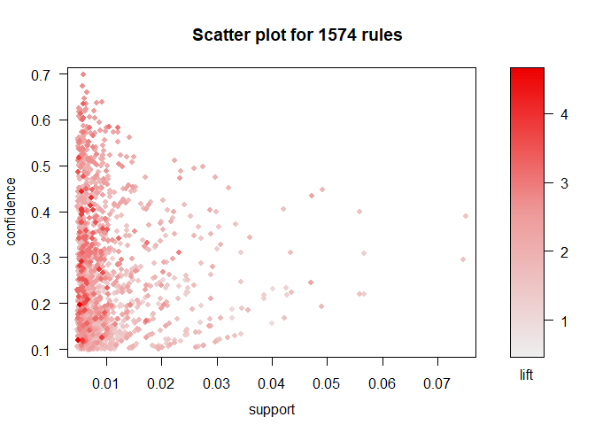

Association Rule Mining
================

## The Data in Question

The data to be examined contains fifteen thousand grocery store
transactions. Each transaction contains between 1 and 4 items,
inclusive. The head of the dataset is previewed below.

Before looking for association rules apriori, it is important to examine
the frequency with which each item is purchased in case there is a
heavily skewed support distribution. Such analysis gives an indication
of the importance of lift in the rules to be produced.

``` r
occurrences = sort(table(unlist(groceries_df)))
#plot(sort(occurrences), xlab = "items purchased", ylab = "occurrences")
df = as.data.frame(occurrences)
ggplot(df, aes(x=Var1, y=Freq)) + 
  geom_bar(stat='identity') +
  ggtitle("Frequency of Items in Groceries.txt") +
  xlab("Purchased Item (Sorted)") +
  ylab("Occurrences")+
  theme(
    axis.text.x = element_blank(),
    plot.title = element_text(size = 15, face = "bold", hjust = 0.5)
    )
```

<!-- -->

``` r
rules = apriori(groceries, 
    parameter=list(support=.005, confidence=.1, maxlen=5, minlen = 2))
```

    ## Apriori
    ## 
    ## Parameter specification:
    ##  confidence minval smax arem  aval originalSupport maxtime support minlen
    ##         0.1    0.1    1 none FALSE            TRUE       5   0.005      2
    ##  maxlen target   ext
    ##       5  rules FALSE
    ## 
    ## Algorithmic control:
    ##  filter tree heap memopt load sort verbose
    ##     0.1 TRUE TRUE  FALSE TRUE    2    TRUE
    ## 
    ## Absolute minimum support count: 49 
    ## 
    ## set item appearances ...[0 item(s)] done [0.00s].
    ## set transactions ...[169 item(s), 9835 transaction(s)] done [0.00s].
    ## sorting and recoding items ... [120 item(s)] done [0.00s].
    ## creating transaction tree ... done [0.00s].
    ## checking subsets of size 1 2 3 4 done [0.00s].
    ## writing ... [1574 rule(s)] done [0.00s].
    ## creating S4 object  ... done [0.00s].

``` r
#arules::inspect(rules)

arules::inspect(subset(rules, subset=lift > 3 & confidence > 0.2))
```

    ##      lhs                        rhs                         support confidence     lift count
    ## [1]  {herbs}                 => {root vegetables}       0.007015760  0.4312500 3.956477    69
    ## [2]  {sliced cheese}         => {sausage}               0.007015760  0.2863071 3.047435    69
    ## [3]  {berries}               => {whipped/sour cream}    0.009049314  0.2721713 3.796886    89
    ## [4]  {beef}                  => {root vegetables}       0.017386884  0.3313953 3.040367   171
    ## [5]  {onions,                                                                                
    ##       root vegetables}       => {other vegetables}      0.005693950  0.6021505 3.112008    56
    ## [6]  {onions,                                                                                
    ##       other vegetables}      => {root vegetables}       0.005693950  0.4000000 3.669776    56
    ## [7]  {chicken,                                                                               
    ##       whole milk}            => {root vegetables}       0.005998983  0.3410405 3.128855    59
    ## [8]  {frozen vegetables,                                                                     
    ##       other vegetables}      => {root vegetables}       0.006100661  0.3428571 3.145522    60
    ## [9]  {beef,                                                                                  
    ##       other vegetables}      => {root vegetables}       0.007930859  0.4020619 3.688692    78
    ## [10] {beef,                                                                                  
    ##       whole milk}            => {root vegetables}       0.008032537  0.3779904 3.467851    79
    ## [11] {curd,                                                                                  
    ##       whole milk}            => {whipped/sour cream}    0.005897306  0.2256809 3.148329    58
    ## [12] {curd,                                                                                  
    ##       tropical fruit}        => {yogurt}                0.005287239  0.5148515 3.690645    52
    ## [13] {margarine,                                                                             
    ##       whole milk}            => {domestic eggs}         0.005185562  0.2142857 3.377404    51
    ## [14] {butter,                                                                                
    ##       whole milk}            => {domestic eggs}         0.005998983  0.2177122 3.431409    59
    ## [15] {butter,                                                                                
    ##       other vegetables}      => {whipped/sour cream}    0.005795628  0.2893401 4.036397    57
    ## [16] {other vegetables,                                                                      
    ##       whipped/sour cream}    => {butter}                0.005795628  0.2007042 3.621883    57
    ## [17] {butter,                                                                                
    ##       whole milk}            => {whipped/sour cream}    0.006710727  0.2435424 3.397503    66
    ## [18] {whipped/sour cream,                                                                    
    ##       whole milk}            => {butter}                0.006710727  0.2082019 3.757185    66
    ## [19] {butter,                                                                                
    ##       other vegetables}      => {root vegetables}       0.006609049  0.3299492 3.027100    65
    ## [20] {domestic eggs,                                                                         
    ##       other vegetables}      => {whipped/sour cream}    0.005083884  0.2283105 3.185012    50
    ## [21] {domestic eggs,                                                                         
    ##       other vegetables}      => {root vegetables}       0.007320793  0.3287671 3.016254    72
    ## [22] {pip fruit,                                                                             
    ##       whipped/sour cream}    => {other vegetables}      0.005592272  0.6043956 3.123610    55
    ## [23] {tropical fruit,                                                                        
    ##       whipped/sour cream}    => {yogurt}                0.006202339  0.4485294 3.215224    61
    ## [24] {other vegetables,                                                                      
    ##       tropical fruit}        => {whipped/sour cream}    0.007829181  0.2181303 3.042995    77
    ## [25] {root vegetables,                                                                       
    ##       yogurt}                => {whipped/sour cream}    0.006405694  0.2480315 3.460127    63
    ## [26] {other vegetables,                                                                      
    ##       yogurt}                => {whipped/sour cream}    0.010167768  0.2341920 3.267062   100
    ## [27] {citrus fruit,                                                                          
    ##       pip fruit}             => {tropical fruit}        0.005592272  0.4044118 3.854060    55
    ## [28] {pip fruit,                                                                             
    ##       tropical fruit}        => {citrus fruit}          0.005592272  0.2736318 3.306105    55
    ## [29] {citrus fruit,                                                                          
    ##       tropical fruit}        => {pip fruit}             0.005592272  0.2806122 3.709437    55
    ## [30] {pip fruit,                                                                             
    ##       root vegetables}       => {tropical fruit}        0.005287239  0.3398693 3.238967    52
    ## [31] {root vegetables,                                                                       
    ##       tropical fruit}        => {pip fruit}             0.005287239  0.2512077 3.320737    52
    ## [32] {pip fruit,                                                                             
    ##       yogurt}                => {tropical fruit}        0.006405694  0.3559322 3.392048    63
    ## [33] {other vegetables,                                                                      
    ##       pip fruit}             => {tropical fruit}        0.009456024  0.3618677 3.448613    93
    ## [34] {other vegetables,                                                                      
    ##       tropical fruit}        => {pip fruit}             0.009456024  0.2634561 3.482649    93
    ## [35] {citrus fruit,                                                                          
    ##       root vegetables}       => {tropical fruit}        0.005693950  0.3218391 3.067139    56
    ## [36] {root vegetables,                                                                       
    ##       tropical fruit}        => {citrus fruit}          0.005693950  0.2705314 3.268644    56
    ## [37] {other vegetables,                                                                      
    ##       tropical fruit}        => {citrus fruit}          0.009049314  0.2521246 3.046248    89
    ## [38] {citrus fruit,                                                                          
    ##       root vegetables}       => {other vegetables}      0.010371124  0.5862069 3.029608   102
    ## [39] {citrus fruit,                                                                          
    ##       other vegetables}      => {root vegetables}       0.010371124  0.3591549 3.295045   102
    ## [40] {rolls/buns,                                                                            
    ##       shopping bags}         => {sausage}               0.005998983  0.3072917 3.270794    59
    ## [41] {root vegetables,                                                                       
    ##       yogurt}                => {tropical fruit}        0.008134215  0.3149606 3.001587    80
    ## [42] {root vegetables,                                                                       
    ##       tropical fruit}        => {other vegetables}      0.012302999  0.5845411 3.020999   121
    ## [43] {other vegetables,                                                                      
    ##       tropical fruit}        => {root vegetables}       0.012302999  0.3427762 3.144780   121
    ## [44] {fruit/vegetable juice,                                                                 
    ##       other vegetables,                                                                      
    ##       whole milk}            => {yogurt}                0.005083884  0.4854369 3.479790    50
    ## [45] {other vegetables,                                                                      
    ##       whole milk,                                                                            
    ##       yogurt}                => {fruit/vegetable juice} 0.005083884  0.2283105 3.158135    50
    ## [46] {other vegetables,                                                                      
    ##       whipped/sour cream,                                                                    
    ##       whole milk}            => {root vegetables}       0.005185562  0.3541667 3.249281    51
    ## [47] {other vegetables,                                                                      
    ##       root vegetables,                                                                       
    ##       whole milk}            => {whipped/sour cream}    0.005185562  0.2236842 3.120474    51
    ## [48] {other vegetables,                                                                      
    ##       whole milk,                                                                            
    ##       yogurt}                => {whipped/sour cream}    0.005592272  0.2511416 3.503514    55
    ## [49] {pip fruit,                                                                             
    ##       root vegetables,                                                                       
    ##       whole milk}            => {other vegetables}      0.005490595  0.6136364 3.171368    54
    ## [50] {other vegetables,                                                                      
    ##       pip fruit,                                                                             
    ##       whole milk}            => {root vegetables}       0.005490595  0.4060150 3.724961    54
    ## [51] {other vegetables,                                                                      
    ##       root vegetables,                                                                       
    ##       whole milk}            => {pip fruit}             0.005490595  0.2368421 3.130836    54
    ## [52] {other vegetables,                                                                      
    ##       whole milk,                                                                            
    ##       yogurt}                => {pip fruit}             0.005083884  0.2283105 3.018056    50
    ## [53] {citrus fruit,                                                                          
    ##       root vegetables,                                                                       
    ##       whole milk}            => {other vegetables}      0.005795628  0.6333333 3.273165    57
    ## [54] {citrus fruit,                                                                          
    ##       other vegetables,                                                                      
    ##       whole milk}            => {root vegetables}       0.005795628  0.4453125 4.085493    57
    ## [55] {other vegetables,                                                                      
    ##       root vegetables,                                                                       
    ##       whole milk}            => {citrus fruit}          0.005795628  0.2500000 3.020577    57
    ## [56] {root vegetables,                                                                       
    ##       tropical fruit,                                                                        
    ##       whole milk}            => {yogurt}                0.005693950  0.4745763 3.401937    56
    ## [57] {tropical fruit,                                                                        
    ##       whole milk,                                                                            
    ##       yogurt}                => {root vegetables}       0.005693950  0.3758389 3.448112    56
    ## [58] {root vegetables,                                                                       
    ##       whole milk,                                                                            
    ##       yogurt}                => {tropical fruit}        0.005693950  0.3916084 3.732043    56
    ## [59] {root vegetables,                                                                       
    ##       tropical fruit,                                                                        
    ##       whole milk}            => {other vegetables}      0.007015760  0.5847458 3.022057    69
    ## [60] {other vegetables,                                                                      
    ##       tropical fruit,                                                                        
    ##       whole milk}            => {root vegetables}       0.007015760  0.4107143 3.768074    69
    ## [61] {other vegetables,                                                                      
    ##       tropical fruit,                                                                        
    ##       whole milk}            => {yogurt}                0.007625826  0.4464286 3.200164    75
    ## [62] {other vegetables,                                                                      
    ##       whole milk,                                                                            
    ##       yogurt}                => {tropical fruit}        0.007625826  0.3424658 3.263712    75
    ## [63] {other vegetables,                                                                      
    ##       whole milk,                                                                            
    ##       yogurt}                => {root vegetables}       0.007829181  0.3515982 3.225716    77
    ## [64] {other vegetables,                                                                      
    ##       rolls/buns,                                                                            
    ##       whole milk}            => {root vegetables}       0.006202339  0.3465909 3.179778    61

``` r
# plot all the rules in (support, confidence) space
# notice that high lift rules tend to have low support
plot(rules)
```

    ## To reduce overplotting, jitter is added! Use jitter = 0 to prevent jitter.

<!-- -->
