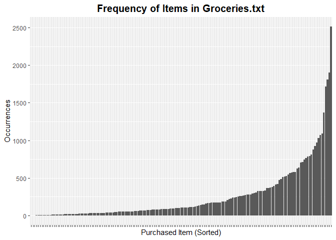
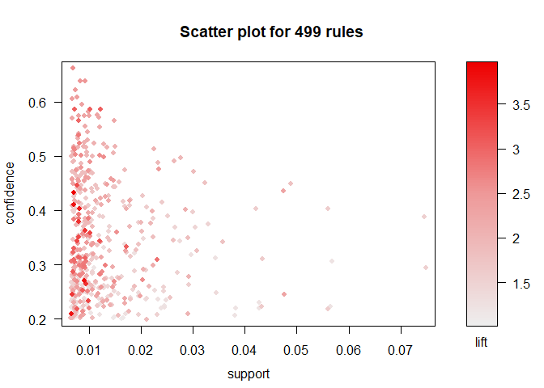
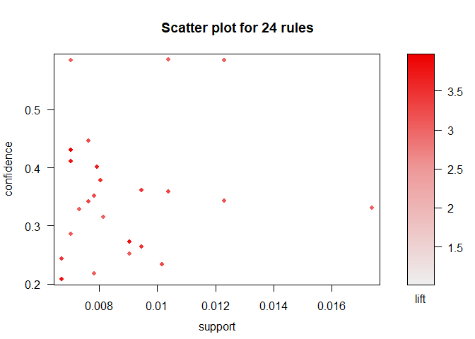

Association Rule Mining
================

## The Data in Question

The data to be examined contains fifteen thousand grocery store
transactions. Each transaction contains between 1 and 4 items,
inclusive. The head of the dataset is previewed
below.

| V1               | V2                  | V3             | V4                       |
| :--------------- | :------------------ | :------------- | :----------------------- |
| citrus fruit     | semi-finished bread | margarine      | ready soups              |
| tropical fruit   | yogurt              | coffee         | NA                       |
| whole milk       | NA                  | NA             | NA                       |
| pip fruit        | yogurt              | cream cheese   | meat spreads             |
| other vegetables | whole milk          | condensed milk | long life bakery product |
| whole milk       | butter              | yogurt         | rice                     |

Before looking for association rules apriori, it is important to examine
the frequency with which each item is purchased in case there is a
heavily skewed support distribution. Such analysis gives an indication
of the importance of lift in the rules to be produced.

<!-- -->

A closer inspection of the far right spike finds that the following
items are very common in the dataset. Here they are:

| Item             | Occurrences |
| :--------------- | ----------: |
| yogurt           |        1372 |
| soda             |        1715 |
| rolls/buns       |        1809 |
| other vegetables |        1903 |
| whole milk       |        2513 |

None of the most common items are surprising to see in the table. Given
that information, a threshold for minimum lift will be considered
carefully, and rules produced which include the above items will be
heavily scrutinized.

## Generate Rules

First, let’s examine every rule generated with at least 100 instances of
the associated purchase pattern (support) and a 10% chance of the right
hand item(s) being purchased with the left-hand item. Since some items
are much more frequent than the others, we will also set an initial lift
threshold of 1, so we know there’s at least some significance to the
pattern.

``` r
# fix this
#kable(head(arules::inspect(sub_rules),15), format = "markdown", row.names = FALSE)
#arules::inspect(sub_rules)
```

Under these conditions, 500 rules are produced. The frequent single
items above are still overly present in the rules, even with the
restriction on
    lift.

    ## To reduce overplotting, jitter is added! Use jitter = 0 to prevent jitter.

<!-- -->

The threshold with be raised, as will it for confidence, to prune the
rules.

<!-- -->

Now there are about 30. As displayed above, the most significant rules
have been picked. These include many larger frequent itemsets with a few
small frequent
itemsets.

``` r
#kable(arules::inspect(better_rules), format = "markdown", row.names = FALSE)
arules::inspect(better_rules)
```

    ##      lhs                     rhs                     support confidence     lift count
    ## [1]  {beef}               => {root vegetables}    0.01738688  0.3313953 3.040367   171
    ## [2]  {root vegetables}    => {beef}               0.01738688  0.1595149 3.040367   171
    ## [3]  {curd}               => {whipped/sour cream} 0.01047280  0.1965649 2.742150   103
    ## [4]  {whipped/sour cream} => {curd}               0.01047280  0.1460993 2.742150   103
    ## [5]  {butter}             => {whipped/sour cream} 0.01016777  0.1834862 2.559698   100
    ## [6]  {whipped/sour cream} => {butter}             0.01016777  0.1418440 2.559698   100
    ## [7]  {pip fruit}          => {tropical fruit}     0.02043721  0.2701613 2.574648   201
    ## [8]  {tropical fruit}     => {pip fruit}          0.02043721  0.1947674 2.574648   201
    ## [9]  {curd,                                                                           
    ##       whole milk}         => {yogurt}             0.01006609  0.3852140 2.761356    99
    ## [10] {whole milk,                                                                     
    ##       yogurt}             => {curd}               0.01006609  0.1796733 3.372304    99
    ## [11] {other vegetables,                                                               
    ##       whole milk}         => {butter}             0.01148958  0.1535326 2.770630   113
    ## [12] {other vegetables,                                                               
    ##       whole milk}         => {domestic eggs}      0.01230300  0.1644022 2.591178   121
    ## [13] {whipped/sour cream,                                                             
    ##       yogurt}             => {other vegetables}   0.01016777  0.4901961 2.533410   100
    ## [14] {other vegetables,                                                               
    ##       whipped/sour cream} => {yogurt}             0.01016777  0.3521127 2.524073   100
    ## [15] {other vegetables,                                                               
    ##       yogurt}             => {whipped/sour cream} 0.01016777  0.2341920 3.267062   100
    ## [16] {whole milk,                                                                     
    ##       yogurt}             => {whipped/sour cream} 0.01087951  0.1941924 2.709053   107
    ## [17] {other vegetables,                                                               
    ##       whole milk}         => {whipped/sour cream} 0.01464159  0.1956522 2.729417   144
    ## [18] {citrus fruit,                                                                   
    ##       root vegetables}    => {other vegetables}   0.01037112  0.5862069 3.029608   102
    ## [19] {citrus fruit,                                                                   
    ##       other vegetables}   => {root vegetables}    0.01037112  0.3591549 3.295045   102
    ## [20] {other vegetables,                                                               
    ##       root vegetables}    => {citrus fruit}       0.01037112  0.2188841 2.644626   102
    ## [21] {root vegetables,                                                                
    ##       tropical fruit}     => {other vegetables}   0.01230300  0.5845411 3.020999   121
    ## [22] {other vegetables,                                                               
    ##       tropical fruit}     => {root vegetables}    0.01230300  0.3427762 3.144780   121
    ## [23] {tropical fruit,                                                                 
    ##       whole milk}         => {root vegetables}    0.01199797  0.2836538 2.602365   118
    ## [24] {other vegetables,                                                               
    ##       yogurt}             => {tropical fruit}     0.01230300  0.2833724 2.700550   121
    ## [25] {tropical fruit,                                                                 
    ##       whole milk}         => {yogurt}             0.01514997  0.3581731 2.567516   149
    ## [26] {whole milk,                                                                     
    ##       yogurt}             => {tropical fruit}     0.01514997  0.2704174 2.577089   149
    ## [27] {root vegetables,                                                                
    ##       yogurt}             => {other vegetables}   0.01291307  0.5000000 2.584078   127
    ## [28] {other vegetables,                                                               
    ##       yogurt}             => {root vegetables}    0.01291307  0.2974239 2.728698   127
    ## [29] {rolls/buns,                                                                     
    ##       root vegetables}    => {other vegetables}   0.01220132  0.5020921 2.594890   120
    ## [30] {other vegetables,                                                               
    ##       rolls/buns}         => {root vegetables}    0.01220132  0.2863962 2.627525   120
    ## [31] {other vegetables,                                                               
    ##       whole milk}         => {root vegetables}    0.02318251  0.3097826 2.842082   228

## Analysis
