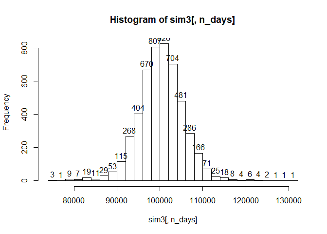

Uploading the libraries

<<<<<<< HEAD
    ## Warning: package 'mosaic' was built under R version 3.6.1

    ## Loading required package: dplyr

    ## Warning: package 'dplyr' was built under R version 3.6.1

=======
``` r
knitr::opts_chunk$set(echo = TRUE)
library(mosaic)
```

    ## Loading required package: dplyr

>>>>>>> 988da5ce24200b0c69863a3d2b96bc02db152c62
    ## 
    ## Attaching package: 'dplyr'

    ## The following objects are masked from 'package:stats':
    ## 
    ##     filter, lag

    ## The following objects are masked from 'package:base':
    ## 
    ##     intersect, setdiff, setequal, union

    ## Loading required package: lattice

    ## Loading required package: ggformula

<<<<<<< HEAD
    ## Warning: package 'ggformula' was built under R version 3.6.1

=======
>>>>>>> 988da5ce24200b0c69863a3d2b96bc02db152c62
    ## Loading required package: ggplot2

    ## Loading required package: ggstance

<<<<<<< HEAD
    ## Warning: package 'ggstance' was built under R version 3.6.1

=======
>>>>>>> 988da5ce24200b0c69863a3d2b96bc02db152c62
    ## 
    ## Attaching package: 'ggstance'

    ## The following objects are masked from 'package:ggplot2':
    ## 
    ##     geom_errorbarh, GeomErrorbarh

    ## 
    ## New to ggformula?  Try the tutorials: 
    ##  learnr::run_tutorial("introduction", package = "ggformula")
    ##  learnr::run_tutorial("refining", package = "ggformula")

    ## Loading required package: mosaicData

<<<<<<< HEAD
    ## Warning: package 'mosaicData' was built under R version 3.6.1

=======
>>>>>>> 988da5ce24200b0c69863a3d2b96bc02db152c62
    ## Loading required package: Matrix

    ## Registered S3 method overwritten by 'mosaic':
    ##   method                           from   
    ##   fortify.SpatialPolygonsDataFrame ggplot2

    ## 
    ## The 'mosaic' package masks several functions from core packages in order to add 
    ## additional features.  The original behavior of these functions should not be affected by this.
    ## 
    ## Note: If you use the Matrix package, be sure to load it BEFORE loading mosaic.

    ## 
    ## Attaching package: 'mosaic'

    ## The following object is masked from 'package:Matrix':
    ## 
    ##     mean

    ## The following object is masked from 'package:ggplot2':
    ## 
    ##     stat

    ## The following objects are masked from 'package:dplyr':
    ## 
    ##     count, do, tally

    ## The following objects are masked from 'package:stats':
    ## 
    ##     binom.test, cor, cor.test, cov, fivenum, IQR, median,
    ##     prop.test, quantile, sd, t.test, var

    ## The following objects are masked from 'package:base':
    ## 
    ##     max, mean, min, prod, range, sample, sum

<<<<<<< HEAD
    ## Warning: package 'quantmod' was built under R version 3.6.1

    ## Loading required package: xts

    ## Warning: package 'xts' was built under R version 3.6.1

    ## Loading required package: zoo

    ## Warning: package 'zoo' was built under R version 3.6.1

=======
``` r
library(quantmod)
```

    ## Loading required package: xts

    ## Loading required package: zoo

>>>>>>> 988da5ce24200b0c69863a3d2b96bc02db152c62
    ## 
    ## Attaching package: 'zoo'

    ## The following objects are masked from 'package:base':
    ## 
    ##     as.Date, as.Date.numeric

    ## Registered S3 method overwritten by 'xts':
    ##   method     from
    ##   as.zoo.xts zoo

    ## 
    ## Attaching package: 'xts'

    ## The following objects are masked from 'package:dplyr':
    ## 
    ##     first, last

    ## Loading required package: TTR

<<<<<<< HEAD
    ## Warning: package 'TTR' was built under R version 3.6.1

=======
>>>>>>> 988da5ce24200b0c69863a3d2b96bc02db152c62
    ## Registered S3 method overwritten by 'quantmod':
    ##   method            from
    ##   as.zoo.data.frame zoo

    ## Version 0.4-0 included new data defaults. See ?getSymbols.

<<<<<<< HEAD
    ## Warning: package 'foreach' was built under R version 3.6.1

Importing the stocks that we want to use

=======
``` r
library(foreach)
```

Importing the stocks that we want to use

``` r
port1 <- c("EDEN", "GXC", "CXSE", "QEMM", "IEMG")

port2 <- c("FSZ", "JPMV",  "FCA", "TUR")

port3 <- c("EWJ", "EWL", "EWN", "ASHR", "KFYP", "GREK", "ERUS")

port1.data <- getSymbols(port1, from = "2014-01-01")
```

>>>>>>> 988da5ce24200b0c69863a3d2b96bc02db152c62
    ## 'getSymbols' currently uses auto.assign=TRUE by default, but will
    ## use auto.assign=FALSE in 0.5-0. You will still be able to use
    ## 'loadSymbols' to automatically load data. getOption("getSymbols.env")
    ## and getOption("getSymbols.auto.assign") will still be checked for
    ## alternate defaults.
    ## 
    ## This message is shown once per session and may be disabled by setting 
    ## options("getSymbols.warning4.0"=FALSE). See ?getSymbols for details.

<<<<<<< HEAD
    ## Warning: EDEN contains missing values. Some functions will not work if
    ## objects contain missing values in the middle of the series. Consider using
    ## na.omit(), na.approx(), na.fill(), etc to remove or replace them.
=======
``` r
port2.data <- getSymbols(port2, from = "2014-01-01")
port3.data <- getSymbols(port3, from = "2014-01-01")
```
>>>>>>> 988da5ce24200b0c69863a3d2b96bc02db152c62

    ## pausing 1 second between requests for more than 5 symbols

    ## pausing 1 second between requests for more than 5 symbols
    ## pausing 1 second between requests for more than 5 symbols

Adjusting for splits and dividends

<<<<<<< HEAD
Combining close to close changes in a single matrix

    ## [1] "Portfolio a: "

=======
``` r
EDENa <- adjustOHLC(EDEN)
GXCa <- adjustOHLC(GXC)
CXSEa <- adjustOHLC(CXSE)
QEMMa <- adjustOHLC(QEMM)
IEMGa <- adjustOHLC(IEMG)

FSZb <- adjustOHLC(FSZ)
JPMVb <- adjustOHLC(JPMV)
FCAb <- adjustOHLC(FCA)
TURb <- adjustOHLC(TUR)

EWJc <- adjustOHLC(EWJ)
EWLc <- adjustOHLC(EWL)
EWNc <- adjustOHLC(EWN)
ASHRc <- adjustOHLC(ASHR)
KFYPc <- adjustOHLC(KFYP)
GREKc <- adjustOHLC(GREK)
ERUSc <- adjustOHLC(ERUS)
```

Combining close to close changes in a single
matrix

``` r
all_returns_a <- cbind(ClCl(EDENa),ClCl(GXCa), ClCl(CXSEa),ClCl(QEMMa),ClCl(IEMGa))
all_returns_b <- cbind(ClCl(FSZb),ClCl(JPMVb), ClCl(FCAb),ClCl(TURb))
all_returns_c <- cbind(ClCl(EWJc),ClCl(EWLc), ClCl(EWNc),ClCl(ASHRc),ClCl(KFYPc),ClCl(GREKc),ClCl(ERUSc))

all_returns_a = as.matrix(na.omit(all_returns_a))
all_returns_b = as.matrix(na.omit(all_returns_b))
all_returns_c = as.matrix(na.omit(all_returns_c))

print("Portfolio a: ")
```

    ## [1] "Portfolio a: "

``` r
head(all_returns_a)
```

>>>>>>> 988da5ce24200b0c69863a3d2b96bc02db152c62
    ##               ClCl.EDENa     ClCl.GXCa    ClCl.CXSEa   ClCl.QEMMa
    ## 2014-06-06 -0.0022484355  0.0002689567 -0.0005862615  0.009933741
    ## 2014-06-09  0.0015023850  0.0084677014  0.0031286665 -0.002131164
    ## 2014-06-10  0.0007499906  0.0058643477  0.0077973101  0.000000000
    ## 2014-06-11 -0.0106801576 -0.0051676030 -0.0069632687  0.000000000
    ## 2014-06-12  0.0077651517 -0.0006659963 -0.0001947409  0.000000000
    ## 2014-06-13 -0.0052621501  0.0106624418  0.0126631205  0.018728422
    ##               ClCl.IEMGa
    ## 2014-06-06  0.0098951880
    ## 2014-06-09  0.0032661288
    ## 2014-06-10  0.0045959019
    ## 2014-06-11 -0.0032405262
    ## 2014-06-12 -0.0036336392
    ## 2014-06-13  0.0001919962

<<<<<<< HEAD
    ## [1] ""

    ## [1] "Portfolio b: "

=======
``` r
print("")
```

    ## [1] ""

``` r
print("Portfolio b: ")
```

    ## [1] "Portfolio b: "

``` r
head(all_returns_b)
```

>>>>>>> 988da5ce24200b0c69863a3d2b96bc02db152c62
    ##                ClCl.FSZb   ClCl.JPMVb     ClCl.FCAb    ClCl.TURb
    ## 2014-06-06 -0.0004515918  0.004694875 -0.0045641716  0.011635866
    ## 2014-06-09  0.0038400497 -0.007009365  0.0000000000  0.001860639
    ## 2014-06-10 -0.0045003826 -0.005098000  0.0050436041  0.013000169
    ## 2014-06-11 -0.0099458178  0.002759145 -0.0018248631 -0.051999983
    ## 2014-06-12  0.0002283562  0.007665075  0.0009141225  0.004043600
    ## 2014-06-13 -0.0034238986 -0.001755413  0.0000000000 -0.006303642

<<<<<<< HEAD
    ## [1] ""

    ## [1] "Portfolio c: "

=======
``` r
print("")
```

    ## [1] ""

``` r
print("Portfolio c: ")
```

    ## [1] "Portfolio c: "

``` r
head(all_returns_c)
```

>>>>>>> 988da5ce24200b0c69863a3d2b96bc02db152c62
    ##               ClCl.EWJc     ClCl.EWLc     ClCl.EWNc    ClCl.ASHRc
    ## 2014-01-03  0.005862710  0.0099348032 -0.0015673981 -0.0045454957
    ## 2014-01-06 -0.003330558 -0.0003073778 -0.0007849686 -0.0249066002
    ## 2014-01-07  0.004177130  0.0009224785  0.0062844464  0.0021286079
    ## 2014-01-08  0.001663852 -0.0012289094  0.0003902420  0.0004247239
    ## 2014-01-09 -0.003322259  0.0055367890  0.0011705424 -0.0148619115
    ## 2014-01-10  0.006666667  0.0104007345  0.0074045207  0.0073275859
    ##              ClCl.KFYPc   ClCl.GREKc   ClCl.ERUSc
    ## 2014-01-03 -0.010716442 -0.010118786 -0.005673712
    ## 2014-01-06 -0.001547601  0.004888933 -0.019495934
    ## 2014-01-07  0.002014972  0.026536841  0.004364597
    ## 2014-01-08  0.014385150  0.026712668 -0.002897127
    ## 2014-01-09  0.000000000  0.005874906 -0.005326804
    ## 2014-01-10  0.000000000  0.014184398  0.018500437

Computing the returns from the closing prices
<<<<<<< HEAD
<!-- --><!-- --><!-- -->
Sampling a random return from the empirical joint distribution
=======

``` r
pairs(all_returns_a)
```

<!-- -->

``` r
pairs(all_returns_b)
```

<!-- -->

``` r
pairs(all_returns_c)
```

<!-- --> Sampling a
random return from the empirical joint distribution

``` r
set.seed(45)
return.today_a <- resample(all_returns_a, 1, orig.ids = FALSE)
return.today_b <- resample(all_returns_b, 1, orig.ids = FALSE)
return.today_c <- resample(all_returns_c, 1, orig.ids = FALSE)
```
>>>>>>> 988da5ce24200b0c69863a3d2b96bc02db152c62

Update the value of my holdings, starting with an equal distribution to
each asset

<<<<<<< HEAD
    ## [1] 100952.9

    ## [1] 98416.81

    ## [1] 100240.9

Loop over 4 trading
weeks

    ## [1] 100104.7

    ## [1] 102691

    ## [1] 94916.98

<!-- --><!-- --><!-- -->

    ##               [,1]      [,2]      [,3]      [,4]      [,5]      [,6]
    ## result.1  99611.53  99215.10  96809.80  95829.40  94317.40  95026.12
    ## result.2  99890.25  99414.76  99973.64  99433.25  99938.88  99295.16
    ## result.3  99555.35 101895.77 101604.30 100125.35 100437.51 100878.09
    ## result.4 100096.03  99941.09 100049.19  99433.99  99170.13  99957.07
    ## result.5  98752.10 100013.43  99277.66  99183.40 100457.08  99996.65
    ## result.6  99086.47  98486.74  98394.70  99334.17  99552.39  98368.74
    ##               [,7]      [,8]      [,9]     [,10]     [,11]     [,12]
    ## result.1  95191.21  95389.06  95061.64  95083.53  95234.81  95015.11
    ## result.2  99999.43 101416.89 101663.99 101785.06 101872.19 101844.75
    ## result.3 101579.25 101375.36 100967.65 101848.41 101182.62 102946.12
    ## result.4 101917.95 102457.05 100247.66 101473.53 100236.21 101972.58
    ## result.5  99415.18  99042.56 100154.14 100102.98 101322.52 100648.66
    ## result.6  98133.63  98892.87  98359.16  97850.92  97742.41  98408.11
    ##              [,13]     [,14]     [,15]     [,16]     [,17]     [,18]
    ## result.1  96168.49  96600.89  95607.15  93961.68  95424.29  95627.37
    ## result.2 102371.08 104609.51 103063.67 104303.18 104906.59 105949.41
    ## result.3 104679.86 105244.25 105026.39 107053.76 107224.22 106647.97
    ## result.4 102244.93 102151.25 102736.69 104108.61 103968.79 103530.06
    ## result.5 100709.14 101393.49 100668.53 100692.32 101853.69 102494.04
    ## result.6  99721.42  99748.20  99860.20 101479.76 101469.15 101007.98
    ##              [,19]    [,20]
    ## result.1  94948.52  93645.5
    ## result.2 106039.26 106705.1
    ## result.3 107018.03 105052.5
    ## result.4 101108.95 100888.2
    ## result.5 101557.68 101194.2
    ## result.6 101339.96  99795.8

<!-- -->

    ##       5% 
    ## 93093.07

Second
    Portfolio

    ##               [,1]      [,2]      [,3]      [,4]      [,5]      [,6]
    ## result.1  99338.01  98894.67 100128.79 101641.11 101529.78 100854.33
    ## result.2 100460.00 100435.37 101866.51 102232.64 100793.71 100997.69
    ## result.3  99820.33  99950.08  99656.58  99651.07 100188.40 100404.69
    ## result.4  99712.93  98915.96  97716.74  97951.19  98325.94  97370.24
    ## result.5  99338.01 100445.07 100481.85  99390.97  99458.92  99270.45
    ## result.6  99698.70  98864.50  99651.95 100293.23 100349.89 101586.26
    ##               [,7]     [,8]      [,9]     [,10]     [,11]     [,12]
    ## result.1 101323.58 101380.0 100352.51 100161.32 100155.24 100060.74
    ## result.2 100255.06 100545.2 100789.11 101346.27 101938.96 100767.30
    ## result.3 101746.50 101468.3 101115.15 101600.88 100171.07 101056.90
    ## result.4  95688.23  96659.7  96050.04  96402.63  97068.08  97513.04
    ## result.5 100231.18 100427.6  99316.51  97683.85  99872.28 100346.33
    ## result.6 101855.53 102915.1 103902.51 103856.90 105228.47 104549.94
    ##              [,13]     [,14]     [,15]     [,16]     [,17]     [,18]
    ## result.1 100472.71 100068.51 100234.01  98564.73  97726.20  98143.95
    ## result.2 101831.18 101604.35 101746.31 102410.10 101682.60 100584.13
    ## result.3 100296.49 100768.22  99190.40  99428.90  98963.55 100842.06
    ## result.4  96317.95  95506.09  95589.36  95454.14  95041.59  95925.43
    ## result.5 100541.55 100110.86 100535.90 101130.50 101040.94 101803.28
    ## result.6 104515.95 103529.46 103407.15 103808.06 105822.16 105092.64
    ##              [,19]     [,20]
    ## result.1  99850.63 100780.83
    ## result.2 101318.90 101480.24
    ## result.3  97644.26  97960.74
    ## result.4  95131.59  94616.29
    ## result.5 100986.08  99488.65
    ## result.6 104869.00 103646.89

<!-- -->

    ##       5% 
    ## 93199.22

Portfolio
    C

    ##               [,1]      [,2]      [,3]      [,4]      [,5]      [,6]
    ## result.1  99378.26  98464.33  99304.07  97861.09  95714.52  97035.88
    ## result.2  98754.14  98267.54  97152.54  96858.19  96179.49  96467.47
    ## result.3 101995.85 101593.25 101128.69 101394.56 101347.65 101405.05
    ## result.4  99671.63  99663.66  99859.13  99613.49  98921.29  97579.06
    ## result.5 102616.35 101944.77 101590.39 102195.27 100209.87  99971.55
    ## result.6 100261.21  99946.81 100495.33 100570.36 100405.59 100713.30
    ##               [,7]      [,8]     [,9]     [,10]    [,11]     [,12]
    ## result.1  95088.12  94450.39 94234.70  96243.59 95525.02  95759.75
    ## result.2  95811.99  95745.99 95311.66  97120.34 96232.58  96471.84
    ## result.3  99350.99 101051.41 98837.66  98381.24 99969.54 100453.11
    ## result.4  96803.42  97933.87 98246.69  98510.11 99054.62  99519.32
    ## result.5 100578.32 100032.61 99357.73  99746.85 99664.51  96881.89
    ## result.6 101158.52 100521.80 99733.75 100367.48 99805.58  97904.69
    ##             [,13]     [,14]     [,15]     [,16]     [,17]     [,18]
    ## result.1 95839.17  96512.70  95589.94  95364.10  93431.29  92534.63
    ## result.2 97344.67  97360.46  98238.65  99534.41  97398.62  97309.52
    ## result.3 99591.36  97669.60  97340.80  96825.90  95988.98  97450.58
    ## result.4 99780.56 102391.06 100517.43 102193.37 102001.58 101996.61
    ## result.5 97952.65  98202.85  97842.45  98079.16  95516.64  95253.73
    ## result.6 97991.51  97467.25  97509.38  98108.35  98311.80  98779.36
    ##              [,19]     [,20]
    ## result.1  92219.68  92586.01
    ## result.2  99049.02  99480.09
    ## result.3  97835.77  97997.70
    ## result.4 101990.19 101743.15
    ## result.5  95872.66  96344.79
    ## result.6  98172.18  98200.23

<!-- -->

    ##       5% 
    ## 91968.47
=======
``` r
set.seed(45)
total_wealth = 100000
my_weights_a <- c(0.2, 0.2, 0.2, 0.2, 0.2)
my_weights_b <- c(0.25, 0.25, 0.25, 0.25)
my_weights_c <- c(0.14, 0.14, 0.15, 0.14, 0.14, 0.14, 0.15)

holdings_a <- total_wealth*my_weights_a
holdings_b <- total_wealth*my_weights_b
holdings_c <- total_wealth*my_weights_c

holdings_a <- holdings_a*(1+return.today_a)
holdings_b <- holdings_b*(1+return.today_b)
holdings_c <- holdings_c*(1+return.today_c)

total_wealth_a <- sum(holdings_a)
total_wealth_b <- sum(holdings_b)
total_weatlh_c <- sum(holdings_c)

total_wealth_a
```

    ## [1] 100952.9

``` r
total_wealth_b
```

    ## [1] 98416.81

``` r
total_weatlh_c
```

    ## [1] 100240.9

Loop over 4 trading weeks

``` r
set.seed(45)
total_wealth = 100000
my_weights_a <- c(0.2, 0.2, 0.2, 0.2, 0.2)
my_weights_b <- c(0.25, 0.25, 0.25, 0.25)
my_weights_c <- c(0.14, 0.14, 0.15, 0.14, 0.14, 0.14, 0.15)

holdings_a <- total_wealth*my_weights_a
holdings_b <- total_wealth*my_weights_b
holdings_c <- total_wealth*my_weights_c

n_days = 20
wealthtracker_a = rep(0, n_days)
wealthtracker_b = rep(0, n_days)
wealthtracker_c = rep(0, n_days)
for(today in 1:n_days){
  return.today_a <- resample(all_returns_a, 1, orig.ids = FALSE)
  return.today_b <- resample(all_returns_b, 1, orig.ids = FALSE)
  return.today_c <- resample(all_returns_c, 1, orig.ids = FALSE) 
  
  holdings_a <- holdings_a*(1+return.today_a)
  holdings_b <- holdings_b*(1+return.today_b)
  holdings_c <- holdings_c*(1+return.today_c)
  
  total_wealth_a <- sum(holdings_a)
  total_wealth_b <- sum(holdings_b)
  total_wealth_c <- sum(holdings_c)
  
  wealthtracker_a[today] = total_wealth_a
  wealthtracker_b[today] = total_wealth_b
  wealthtracker_c[today] = total_wealth_c
  
}

total_wealth_a
```

    ## [1] 100104.7

``` r
total_wealth_b
```

    ## [1] 102691

``` r
total_wealth_c
```

    ## [1] 94916.98

``` r
plot(wealthtracker_a, type = 'l')
```

<!-- -->

``` r
plot(wealthtracker_b, type = 'l')
```

<!-- -->

``` r
plot(wealthtracker_c, type = 'l')
```

<!-- -->

Second Portfolio

``` r
knitr::opts_chunk$set(echo = TRUE)
initial_wealth = 100000
sim2 = foreach(i = 1:5000, .combine = "rbind")%do%{
  total_wealth_b = initial_wealth
  
  my_weights_b <- c(0.25, 0.25, 0.25, 0.25)
  
  holdings_b <- my_weights_b*total_wealth_b
  
  n_days = 20
  
  wealthtracker_b = rep(0, n_days)
  
  for(today in 1:n_days){
    return.today_b <- resample(all_returns_b, 1, orig.ids = FALSE)
  
    holdings_b <- holdings_b*(1+return.today_b)
  
    total_wealth_b <- sum(holdings_b)
  
    wealthtracker_b[today] = total_wealth_b
  }
  wealthtracker_b

  
}
head(sim2)
```

    ##               [,1]      [,2]      [,3]      [,4]      [,5]      [,6]
    ## result.1 100069.09  99504.49 100239.77 101742.54 102306.67 102292.39
    ## result.2 100212.53 100428.40 102200.01 104151.79 103875.69 103657.38
    ## result.3 100853.32 101869.97 102674.87 102639.20 103702.01 105245.96
    ## result.4 100871.72 101898.85 101842.91 102619.58 102834.31 102624.07
    ## result.5  99857.27  97376.31  98003.09  97887.97  97793.52  97413.71
    ## result.6 100527.75  99963.53  99971.77 101271.77 101545.28 101542.11
    ##               [,7]      [,8]      [,9]     [,10]     [,11]     [,12]
    ## result.1 102000.15 100125.32  99595.93 100079.51  99793.38  99690.28
    ## result.2 102396.45 102949.80 103368.60 103144.50 103589.20 103389.24
    ## result.3 105299.76 105808.16 106400.91 106658.02 107398.08 107251.09
    ## result.4 103254.17 102544.38 103836.22 104190.83 104714.52 103194.47
    ## result.5  97309.82  96628.53  97257.68  97443.53  96391.40  96322.86
    ## result.6 101347.86  99398.50  99657.77  99041.67  99408.89  99741.64
    ##              [,13]     [,14]     [,15]     [,16]    [,17]    [,18]
    ## result.1  99520.97 100455.89 100249.48 100049.60 101991.5 103088.5
    ## result.2 103184.53 104923.90 104668.27 104829.71 104458.0 104404.1
    ## result.3 106588.64 106738.72 107097.80 107051.86 107031.5 107344.6
    ## result.4 103500.55 103138.94 104110.34 104732.24 105984.9 106578.2
    ## result.5  96334.62  99057.13  99248.74  98873.59 100508.0 100180.5
    ## result.6 100194.32 100245.25 100638.97 102129.36 102503.9 102835.9
    ##             [,19]    [,20]
    ## result.1 103282.5 103049.8
    ## result.2 105836.4 105456.5
    ## result.3 105377.3 104223.6
    ## result.4 105441.5 107499.8
    ## result.5 102197.1 100493.1
    ## result.6 102194.3 101777.8

``` r
hist(sim2[,n_days], labels = TRUE,25)
```

<!-- -->

``` r
VAR = quantile(sim2[,n_days], .05)
VAR
```

    ##       5% 
    ## 93234.85

Portfolio C

``` r
knitr::opts_chunk$set(echo = TRUE)
initial_wealth = 100000
sim3 = foreach(i = 1:5000, .combine = "rbind")%do%{
  total_wealth_c = initial_wealth
  
  my_weights_c <- c(0.14, 0.14, 0.15, 0.14, 0.14, 0.14, 0.15)
  
  holdings_c <- my_weights_c*total_wealth_c
  
  n_days = 20
  
  wealthtracker_c = rep(0, n_days)
  
  for(today in 1:n_days){
    return.today_c <- resample(all_returns_c, 1, orig.ids = FALSE)
  
    holdings_c <- holdings_c*(1+return.today_c)
  
    total_wealth_c <- sum(holdings_c)
  
    wealthtracker_c[today] = total_wealth_c
  }
  wealthtracker_c

  
}
head(sim3)
```

    ##               [,1]      [,2]      [,3]      [,4]      [,5]      [,6]
    ## result.1  99842.84 100729.01 101138.92 100325.41 101124.20 102330.98
    ## result.2 101007.11 102304.86 104051.95 103549.75 102710.24 104394.14
    ## result.3 100201.08 100019.15 100282.81 100239.82  99771.65 100446.96
    ## result.4  99873.81 100154.12 100784.25 100679.43 101759.51 102122.56
    ## result.5  99026.10  98309.49  98402.94  98606.19  98723.05  98719.79
    ## result.6  99636.22  99993.29 100806.06 101094.28 100260.40 101122.38
    ##               [,7]      [,8]      [,9]     [,10]     [,11]     [,12]
    ## result.1 102570.79 102591.26 103943.39  99933.63 100376.19 102625.27
    ## result.2 105053.62 103970.13 104533.71 104930.00 105824.21 105838.19
    ## result.3 101159.16 102791.33 102825.78 103342.50 104319.07 103965.51
    ## result.4 101531.89  99416.44 100128.82  99554.44  99296.60  98838.27
    ## result.5  98190.96  95893.17  96722.86  98347.42  97685.76  96694.08
    ## result.6 100309.67  99290.68  98837.29  99065.03  99438.31  99733.73
    ##              [,13]     [,14]     [,15]     [,16]     [,17]     [,18]
    ## result.1  99717.27  98401.74  97314.15  96578.42  96056.96  95911.96
    ## result.2 105522.67 105864.06 105485.29 104840.33 105994.52 106543.87
    ## result.3 104245.80 106125.72 105430.60 104846.94 106302.47 107860.42
    ## result.4  97472.03  98428.83  97706.93  96901.01  95735.28  94260.28
    ## result.5  97078.66  96098.15  95387.28  95535.45  95745.94  95841.02
    ## result.6 100486.77 103565.86 103685.16 104106.71 105451.08 105620.23
    ##              [,19]     [,20]
    ## result.1  95723.14  93308.63
    ## result.2 109226.27 106359.30
    ## result.3 106852.67 105159.78
    ## result.4  91934.46  89580.77
    ## result.5  95689.65  96766.28
    ## result.6 105146.26 104784.34

``` r
hist(sim3[,n_days], labels = TRUE, 25)
```

<!-- -->

``` r
VAR = quantile(sim3[,n_days], .05)
VAR
```

    ##       5% 
    ## 92038.78
>>>>>>> 988da5ce24200b0c69863a3d2b96bc02db152c62

I selected the portfolios with the intention of giving each one a
different aim, despite all of the ETF’s being chosen from either the
China ETF category, the Japan ETF category, Euro ETF category, or the
Emerging Markets category. The first portfolio was chosen by being
comprised of ETF’s which have the highest previous day’s closing cost.
It contained 5 ETF’s (EDEN, GXC, CXSE, QEMM, and IEMG), with closing
costs ranging from $47.99 to $87.82. The second portfolio contained 4
ETF’s (FSZ, JPMV, FCA, and TUR), and those ETF’s were chosen with the
aim of minimizing the percent change from the previous day (in order to
minimize short-term volatility). The third portfolio contained 7 ETF’s
(EWJ, EWL, EWN, ASHR, KFYP, GREK, and ERUS), and were chosen with the
intention of maximizing YTD, in order to maximize long-term growth. For
the first portfolio the VaR was equal to 93091.06. That means that there
is if there were no trading over the course of a day, there is a 5%
chance that the stock would decrease in value by $93,091.06. For the 2nd
portfolio, the VaR was equal to 93291.91, and the third portfolio had a
VaR of 91864.87. These both translate to roughly the same thing as did
portfolio 1. Looking at the histograms, portofolio 1 had a maximum value
between 100000 and 102000, implying that at the very least, you would
make back what you’d invested a majority of the time. Portfolio 2 had an
absolute maximum value between 100000 and 101000, implying that you’d
also make back your money by investing in that stock a majority of the
time. Histogram 3 however had a majority of values between 98000 and
100000, implying that a majority of days, you would actually be losing
money. This narrows us down to Portfolio 1 and Portfolio 3. Looking back
at VaR, we see that portfolio 1 has a fatter tail than portfolio 3,
therefore we choose Portfolio 3 for the purpose of our experiment.
