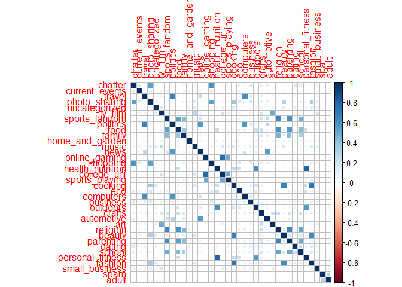

Market Segmentation
================

## Data Description

We have a dataset of the number of tweets from customers of an
anonymised firm, in terms of categories of the tweets.

A brief summary of the data:

<!-- -->

‘Chatter’ category (uncategorised posts) has the most number of posts,
which isn’t informative. Photo-sharing, nutrition, cooking, and politics
are also popular categories.

Are there any categories that are positively correlated with each other?

<!-- -->

Online gaming and universties are correlated categories. Let us plot a
correlation for all categories.

    ## Warning: package 'corrplot' was built under R version 3.6.1

    ## corrplot 0.84 loaded

<!-- -->

The following categories are highly correlated: (represented by dark
squares)

1)  Personal fitness & nutrition,
2)  fashion and cooking,
3)  politics and travel,
4)  religion and sports fandom
5)  Online gaming and universities

However, these show us correlations in two dimensions. To better
understand market segments, let us perform k-means clustering.

## K-means Clustering

Including only the measureable categories for clustering:

### Choosing the value of K

Choosing the number of clusters is completely subjective based either on
business goals or mathematical basis. Let us plot the elbow plot to get
a sense of the number of clusters to be used.

<!-- -->

Let us choose k = 5 as the optimum number of clusters.

K-means clustering will provide us with information on what posts are
tweeted togeher, which will help us create buyer personas in order to
better tailor advertising
    campaigns.

### CLuster 1

    ##       chatter      politics photo_sharing   college_uni        travel 
    ##      6.533920      4.398869      3.885678      3.432161      3.168970 
    ##          news 
    ##      2.568467

### Cluster 2

    ##          cooking    photo_sharing          fashion          chatter 
    ##        11.241007         6.008993         5.719424         4.517986 
    ##           beauty health_nutrition 
    ##         3.994604         2.372302

### Cluster 3

    ## health_nutrition personal_fitness          chatter          cooking 
    ##        12.093574         6.506201         4.166855         3.267193 
    ##         outdoors    photo_sharing 
    ##         2.768884         2.506201

### Cluster 4

    ## sports_fandom      religion          food     parenting       chatter 
    ##      6.000000      5.401077      4.641992      4.161507      4.083445 
    ##        school 
    ##      2.769852

### Cluster 5

    ##          chatter    photo_sharing   current_events health_nutrition 
    ##        3.6615497        1.8652534        1.3421053        1.0913743 
    ##           travel         politics 
    ##        1.0609162        0.9973197

## Market Segments

Our clustering analysis suggests the following market segments:

1)  **Young parents:** This segment has shared posts about parenting and
    schooling - suggesting that they might be parents of a young child,
    discovering the ways of parenting. Posts about religion and sports
    may suggest that they’re trying to generate an interest in these
    categories regarding these categories.

2)  **Knowledgeable college students**: This segment has shown activity
    in categories such as college, current events, and travelling.
    College students travel often for vacation, studies, or internships,
    and thus, this segment appears to represent smart college students.

3)  **Health freaks**: Cooking, health & nutrition, and personal fitness
    would mean that this segment is committed to maintain great health.

4)  **Tech-savvy business travellers**: With posts spanning politics,
    technology, news, and travel, this segment possibly represents
    well-educated business-people who travel often for work.

5)  **Millenial Influencers**: This segment indulges in shopping,
    fashion, and photo-sharing. They’re possibly social media
    influencers.

As we can see, all segments generally point towards a young customer
base. These segments can help our client design better marketing
rhetoric.
